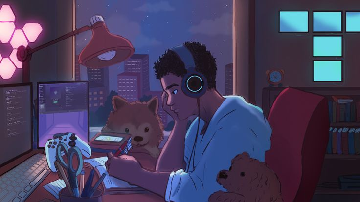

  

#

 Olá! Sou Vic Freitas, estudante de Letras com habilitação em português e espanhol e de Análise e Desenvolvimento de Sistemas. Sou uma pessoa curiosa, apaixonada por tecnologia e educação. Atualmente estou iniciando minha trajetória nos estudos na área de desenvolvimento de software. Meu objetivo é ingressar no mercado na área de tecnologia para colocar em prática as habilidades que estou desenvolvendo. Espero que goste do que vai encontrar por aqui! 😠

#

<h3 align="left">Conecte-se comigo!</h3>

  <a href = "mailto:victoria.freitax@usp.br" target="_blank"><a>
 
 

  
  
  
  
  
  
  
  
  
  
  
  
  
  
  
  
  

#

  <h3>* GitHub Stats *</h3>
   
  

  

#

<picture align="center">
  <source media="(prefers-color-scheme: dark)" srcset="https://raw.githubusercontent.com/mari4souza/mari4souza/output/github-contribution-grid-snake-dark.svg">
  
</picture>

<!--
**vicfreitax/vicfreitax** is a ✨ _special_ ✨ repository because its `README.md` (this file) appears on your GitHub profile.

Here are some ideas to get you started:

- 🔭 I’m currently working on ...
- 🌱 I’m currently learning ...
- 👯 I’m looking to collaborate on ...
- 🤔 I’m looking for help with ...
- 💬 Ask me about ...
- 📫 How to reach me: ...
- 😄 Pronouns: ...
- ⚡ Fun fact: ...
-->
